# Doctor Notes Text Analytics- Code Repository

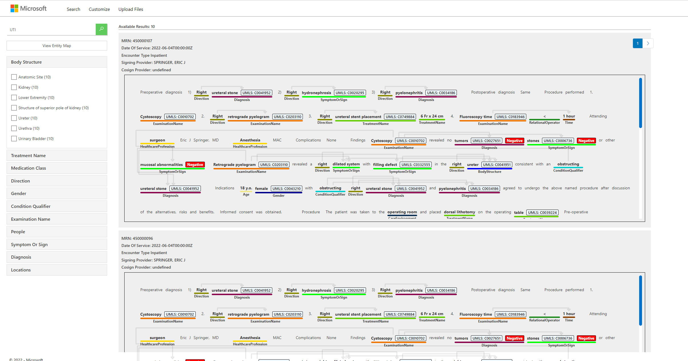

## Overview

Source Code Repository for the Cognitive Search based [Doctor Notes with Text Analytics Search App](https://doctornotessearchpoc.azurewebsites.net/)

If you simply want to show this code in a running instance, feel free to use <https://doctornotessearchpoc.azurewebsites.net/>.  Otherwise, you can follow the [setup instructions](#setup) below to recreate your own instance in your Azure subscription.  

This repository contains:

* AzureCognitiveSearchService: The components to set up the Cognitive Search service
* InvokeHealthEntityExtraction: An Azure Function to call the Text Analytics for Health container which is invoked as a custom skill

## Purpose

Many doctors would like to be able to search patient notes to extract and find meaningful patient data, find patterns or for research.  How can we use AI to better understand to achieve this goal?  In this code, we take a sample set of fake doctor notes and apply several machine learning techniques (name entity recognition of medical terms, finding semantically similar words, and knowledge graphs) medical professionals better find and make sense of the research they need.  

## Architecture

Data is pulled from an Azure SQL Database. The main indexer runs data in json format through a skillset which reshapes the data and extracts medical entities, and puts the enriched data in the search index, it also saves Azure Text for Analytics json to the database render marked-up text.

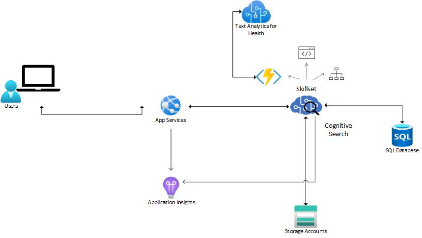

## Skills and Assumptions


## Setup Tasks

1. Azure account - login or create one
2. Create a resource group
3. Import database package
4. Implement Text Analytics For Health
5. Deploy InvokeHealthEntityExtraction Azure function
6. Create a Storage Account
7. Create Azure search service
8. Run Notebook to configure Indexes and Data for Azure Search
9. Deploy Website

### Task 1 - Azure Account

First, you will need an Azure account.  If you don't already have one, you can start a free trial of Azure [here](https://azure.microsoft.com/free/).  

___

### Task 2 - Create a resource group

If you are new to Azure,a resource group is a container that holds related resources for an Azure solution. The resource group can include all the resources for the solution, or only those resources that you want to manage as a group, click [here](https://learn.microsoft.com/en-us/azure/azure-resource-manager/management/manage-resource-groups-portal#create-resource-groups) to learn how to create a group

___

### Task 3 - Import database package

Upload the file doctor-note-poc-bacpac located under the folder dat-files to a storage account in your subscription

Import the database package to a serverless database, for more information on how to do this click [here](https://learn.microsoft.com/en-us/azure/azure-sql/database/database-import?view=azuresql&tabs=azure-powershell)

If you have never done this, follow the steps:

Click on create new resource and search for SQL Server (logical server) and select that option

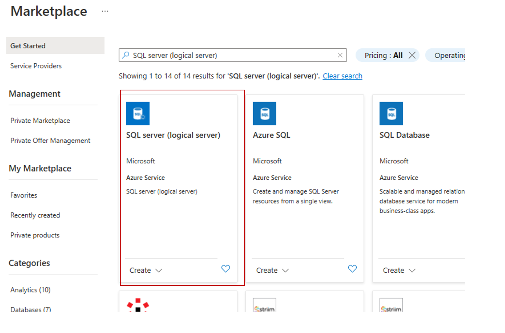

Click the create button

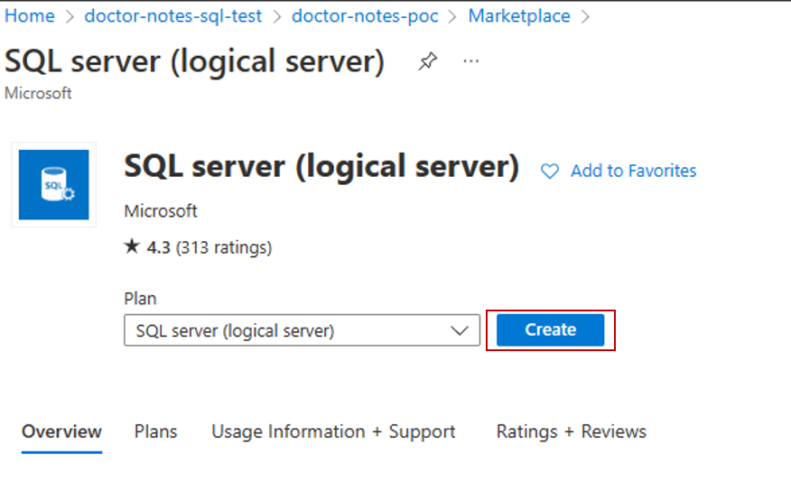

Select the resource group you previously created

Enter a name for the server and a location that matches the location of your resource group. Select use both SQL and Azure AD authentication, add yourself as Azure AD admin. Enter a not easy to guess user name and password for the server. Click Networking

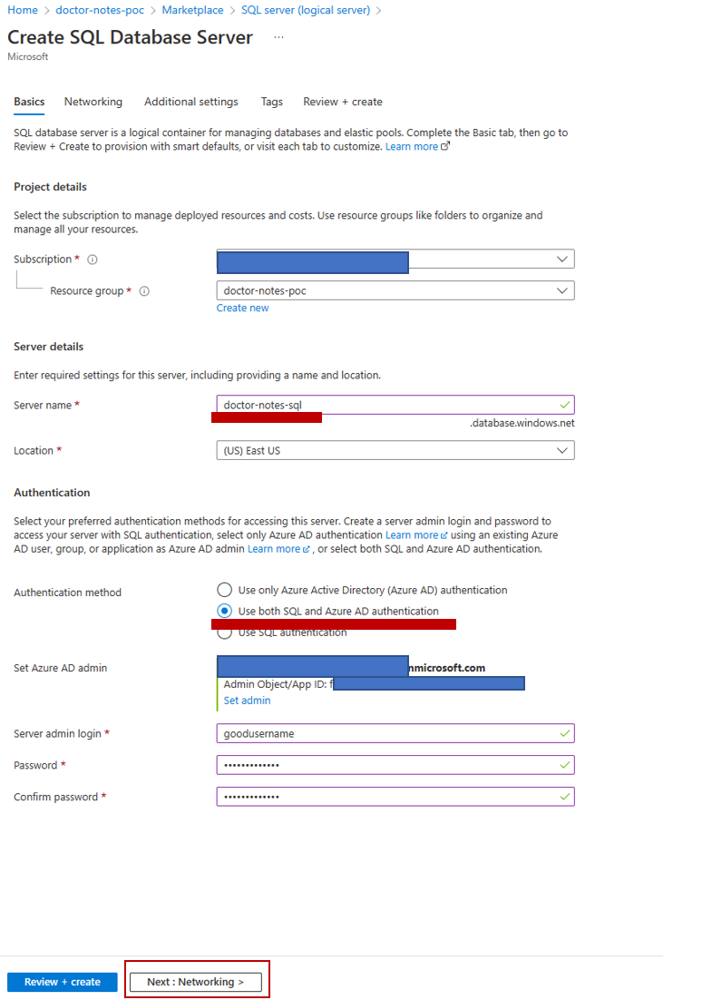

Under firewall rules select Allow Azure Services and resources to access this server. Click Review + create

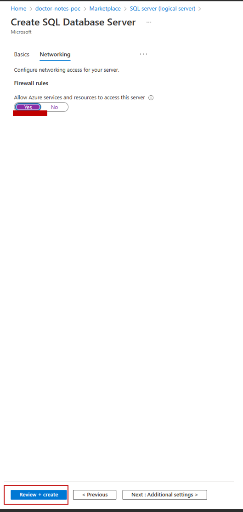

Verify all information is correct, click on "Create"

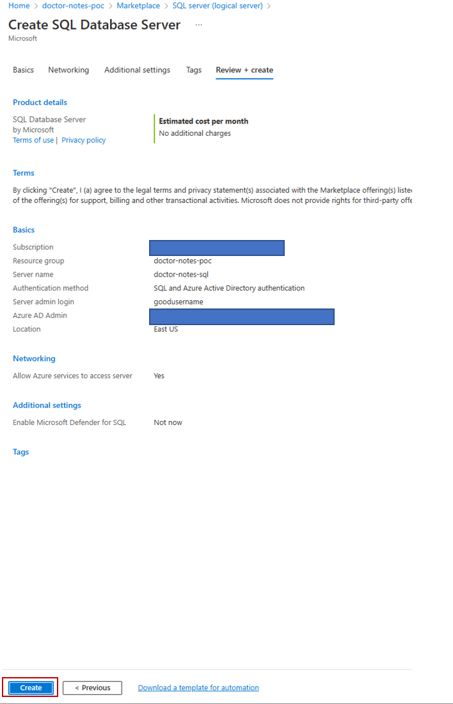

Once your database is created, navigate to your new SQL Server and click on Import Database

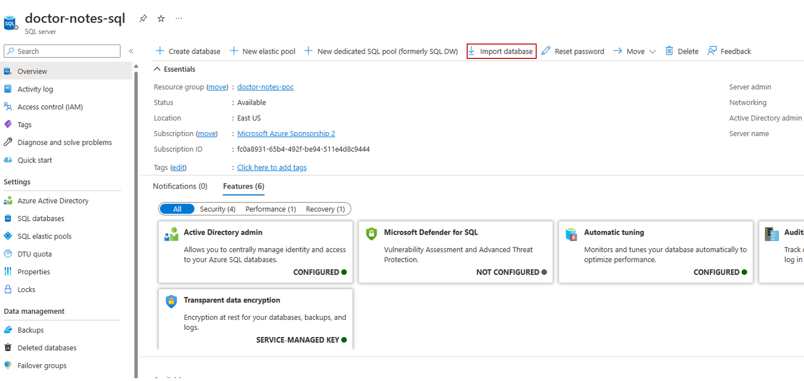

Once on the Import dabase select backup

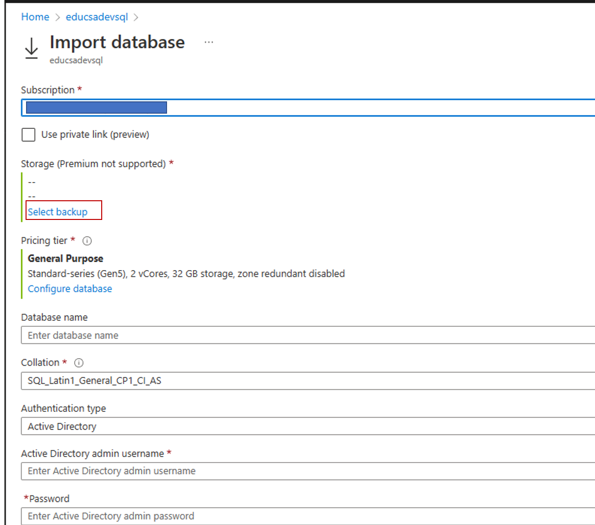

Select the storage account where you uploaded the database file and navigate to the file. Click Select

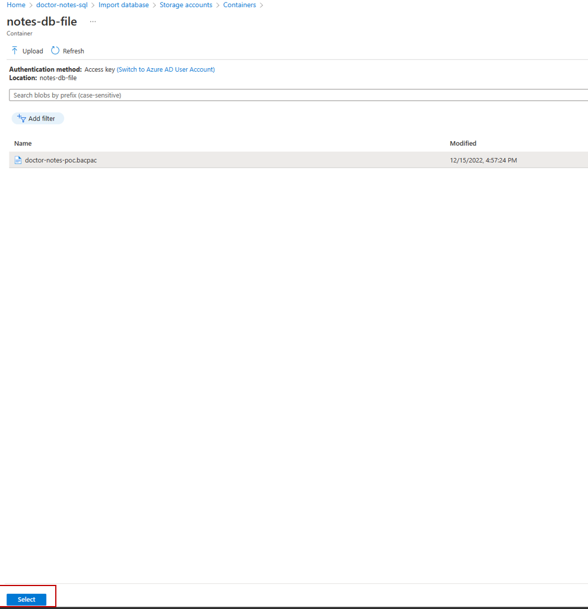

Next click configure database

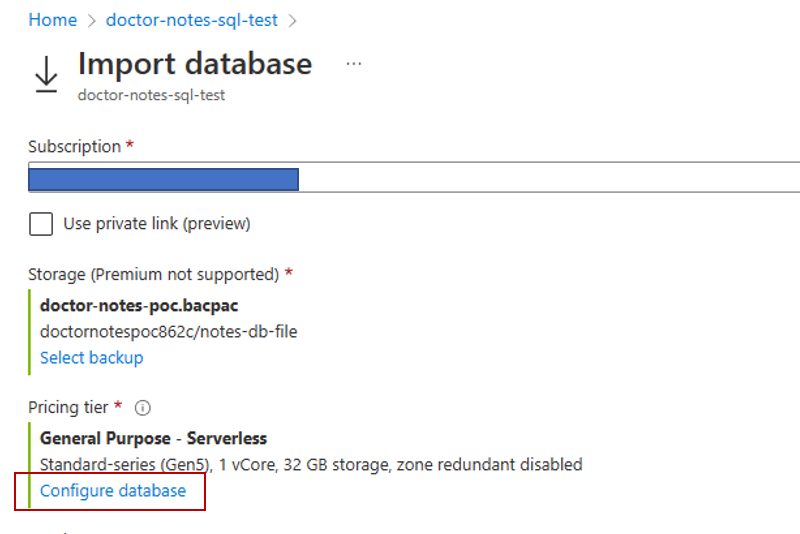

Under computer tier, select serverless, click ok

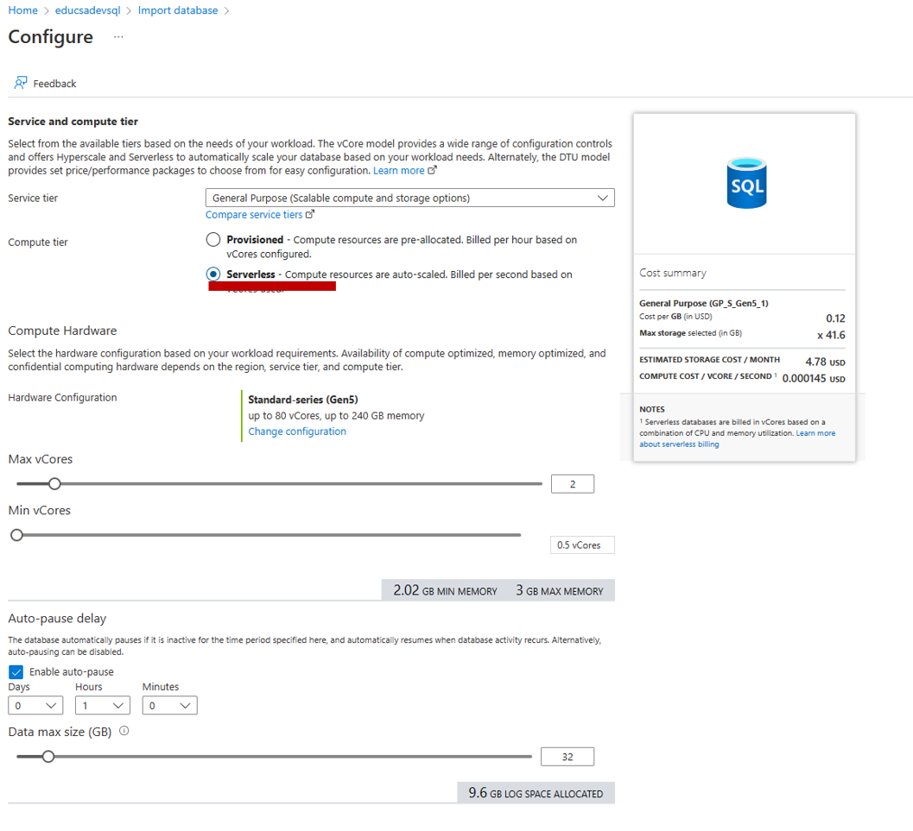

Enter a data base name, select SQL server authentication and enter the user name & password you defined for the SQL Server, click ok

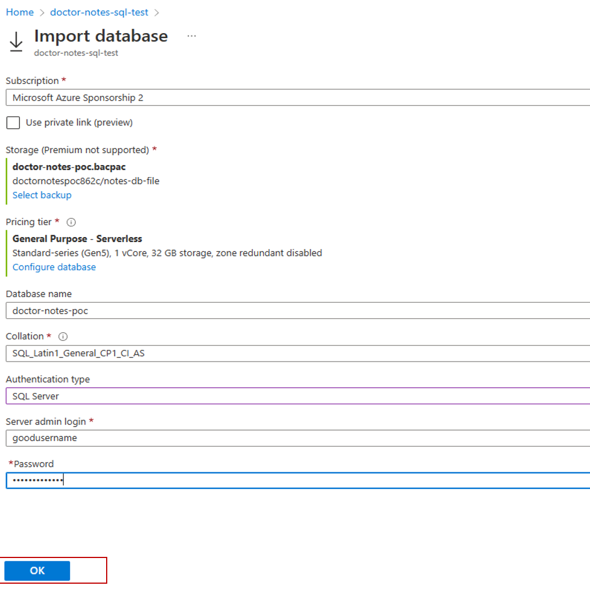

Navigate to your SQL server, and select import/export history to see the progress of your import, once completed, navigate to databases to look at your new imported database

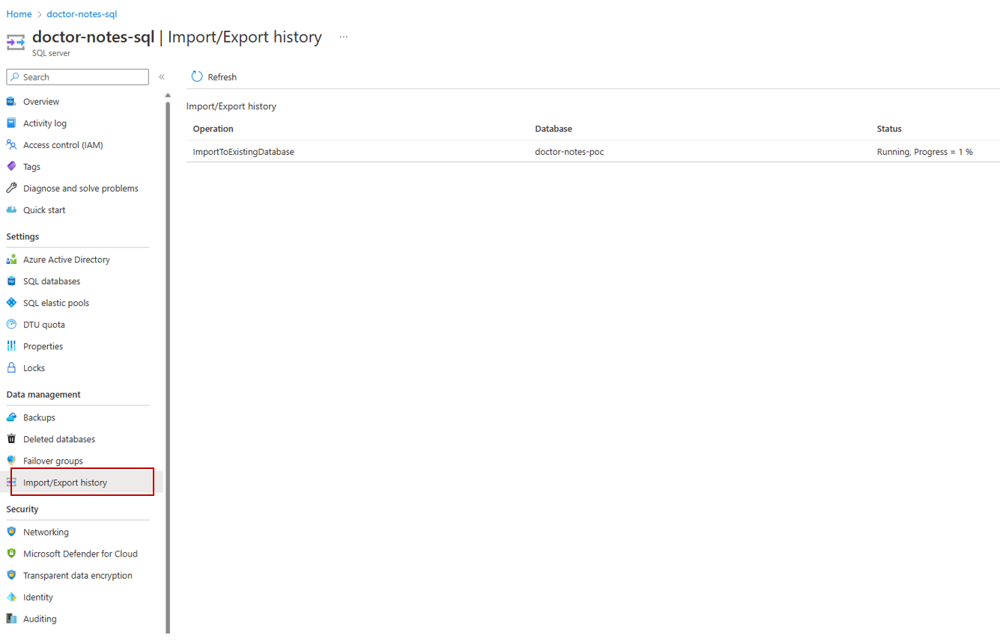

Once on your imported database, select Query editor and enter your user credentials. Loging will fail as you need to grant access to your IP address. Click on Allow IP server and then login

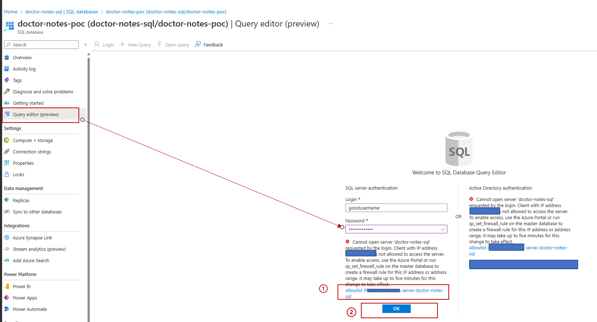

Once on the query screen copy and paste this sql statement and click Run to verify data was imported

```sql
Select * from DoctorNotes
 
```


___

### Task 4 - Implement Text Analytics For Health

Our implementation uses the [Text Analytics for Health](https://docs.microsoft.com/en-us/azure/cognitive-services/text-analytics/how-tos/text-analytics-for-health?tabs=ner) container for medical entity extraction.  Once you have received access, you will need to set up the container as instructed in their README.

___

### Task 5 - Deploy InvokeHealthEntityExtraction Azure function

Then, you will need to update the InvokeHealthEntityExtraction Azure function with the location of your running container.  You will also need to download a file umls_concept_dict.pickle that is too big to host on GitHub, which will allow lookup of [UMLS](https://www.nlm.nih.gov/research/umls/index.html) entities.  

Specifically, in the InvokeHealthEntityExtraction\InvokeHealthEntityExtraction folder:

* Download the [umls_concept_dict.pickle file](https://covid19storagejen.blob.core.windows.net/public/umls_concept_dict.pickle) and save to this directory InvokeHealthEntityExtraction\InvokeHealthEntityExtraction (the same directory as __init__.py) so it will deploy with the Azure function.  

*After* this action is complete, you can deploy the InvokeHealthEntityExtraction Azure function.  One easy way to deploy an Azure function is using Visual Studio Code.  You can [install VS Code](https://code.visualstudio.com/Download) and then follow some of the instructions at [this link](https://docs.microsoft.com/azure/azure-functions/functions-develop-vs-code?tabs=csharp):

1. Install the [Azure Functions extension](https://docs.microsoft.com/azure/azure-functions/functions-develop-vs-code?tabs=csharp#install-the-azure-functions-extension) for Visual Studio Code

2. [Sign in](https://docs.microsoft.com/azure/azure-functions/functions-develop-vs-code?tabs=csharp#sign-in-to-azure) to Azure

3. [Publish the function](https://docs.microsoft.com/azure/azure-functions/functions-develop-vs-code?tabs=csharp#publish-to-azure) to Azure

After the function is deployed you need to update the function configuration parameters and get the value for the function Url follow these steps:

To update function's configuration parameters, in the Azure portal navigate to your Azure function app, under settings click "configuration", then under "Application settings" click "New application setting" (see image below)

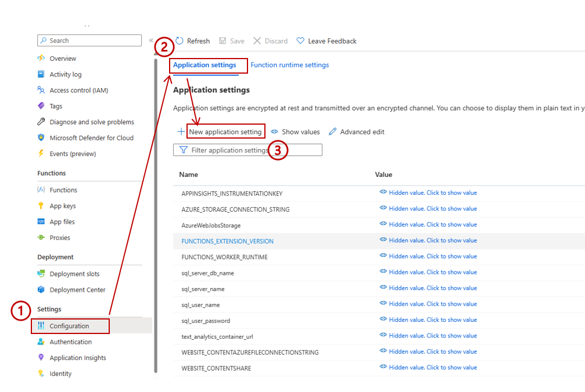

> __Add the following parameters and their corresponding values:__

    text_analytics_container_url: YOUR_CONTAINER_URL

    AZURE_STORAGE_CONNECTION_STRING: YOUR_STORAGE_ACCOUNT_CONNECTION_STRING

    text_analytics_container_url: YOUR_CONTAINER_URL

    text_analytics_container_url: YOUR_CONTAINER_URL

    AZURE_STORAGE_CONNECTION_STRING: YOUR_STORAGE_ACCOUNT_CONNECTION_STRING
    
    sql_server_name:  YOUR_SQL_SERVER_NAME

    sql_server_db_name

    sql_user_name

    sql_user_password

Next Click "Functions" in the left-hand sidebar.  Then click on each function name,  click "Get Function Url" at the top of the page.  Copy that value to a text editor for each function; you will need it later.  

### Task 6 - Create a Storage Account

Create a storage account and get the connection string, you will need this connection string for the next steps. If you have never done that, [here](https://learn.microsoft.com/en-us/azure/storage/common/storage-account-create?tabs=azure-portal) is the documentation to do it.
___

### Task 7 - Create Azure search service

Create a new Azure search service using the Azure portal at <https://portal.azure.com/#create/Microsoft.Search>.  Select your Azure subscription.  Use the previously created resource group. You will need a globally-unique URL as the name of your search service (try something like "doctonotes-search-" plus your name, organization, or numbers).  Finally, choose a nearby location to host your search service - please remember the location that you chose, as your Cognitive Services instance will need to be based in the same location.  Click "Review + create" and then (after validation) click "Create" to instantiate and deploy the service.  

___

### Task 8 - Run Notebooks to create indexes on Azure Search

After deployment of Azure Search service is complete, click "Go to resource" to navigate to your new search service. We will need some information about your search service to fill in the "Azure Search variables" section in the SetupAzureCognitiveSearchService.ipynb notebook, which is in the AzureCognitiveSearchService directory.  Open the notebook for details on how to do this and copy those values into the first code cell, but don't run the notebook yet (you will need to update skillset.json first).  

Before running the notebook, you will also need to change the 4 TODOs in the skillset.json (which is also located in the AzureCognitiveSearchService folder).  Open skillset.json, search for "TODO", and replace each instance with the following:

1. __Invoke TA Health Extraction custom skill URI:__ this value should be "https://" plus the value from the "Get Function Url" for the InvokeHealthEntityExtraction function that you noted down earlier
2. __Cognitive Services key:__ create a new Cognitive Services key in the [Azure portal](https://portal.azure.com/#create/Microsoft.CognitiveServicesAllInOne) using the same subscription, location, and resource group that you did for your Azure search service.  Click "Create" and after the resource is ready, click it.  Click "Keys and Endpoint" in the left-hand sidebar.  Copy the Key 1 value into this TODO.  
3. __Knowledge Store connection string:__ use the value that you noted down earlier of the connection string to the knowledgeStore container in your Azure blob storage.  It should be of the format "DefaultEndpointsProtocol=https;AccountName=YourValueHere;AccountKey=YourValueHere;EndpointSuffix=core.windows.net".  

Finally, you are all set to go into the SetupAzureCognitiveSearchService.ipynb notebook and run it.  This notebook will call REST endpoints on the search service that you have deployed in Azure to setup the search data sources, index, indexers, and skillset.  
